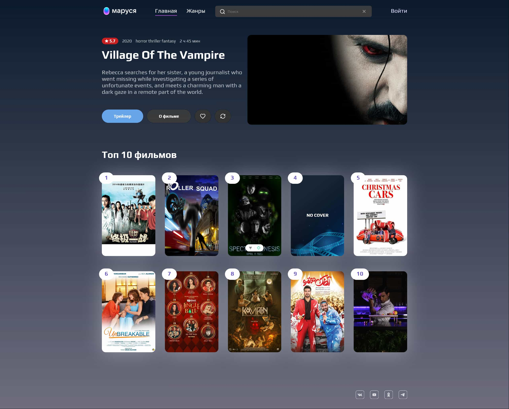

# Video service Marusya
 Video service Marusya gives the opportunity to get information about films, watch a trailer, find the desired film. You can also register and add films to your favorites.

Coursework for the **"Vue.js"** Skillbox course.

Design Layout [VK Marusya](https://www.figma.com/design/8FW6Yt3ztcoYATQhqiy4qK/%D0%9C%D0%B0%D0%BA%D0%B5%D1%82-VK-%D0%9C%D0%B0%D1%80%D1%83%D1%81%D1%8F-%D0%B4%D0%BB%D1%8F-%D0%B4%D0%B8%D0%BF%D0%BB%D0%BE%D0%BC%D0%B0-Vue%2FReact?node-id=0-1&node-type=canvas)

## Service capabilities:
- register as a new user
- user authorization
- add and delete movies in favorites
- get brief information about the movie, watch the trailer
- search for movies by name

 ## Main Page Screenshot


 ## Recommended IDE Setup

[VSCode](https://code.visualstudio.com/) + [Volar](https://marketplace.visualstudio.com/items?itemName=Vue.volar) (and disable Vetur).

## Type Support for `.vue` Imports in TS

TypeScript cannot handle type information for `.vue` imports by default, so we replace the `tsc` CLI with `vue-tsc` for type checking. In editors, we need [Volar](https://marketplace.visualstudio.com/items?itemName=Vue.volar) to make the TypeScript language service aware of `.vue` types.

## Customize configuration

See [Vite Configuration Reference](https://vite.dev/config/).

## Project Setup

```sh
npm install
```

### Compile and Hot-Reload for Development

```sh
npm run dev
```

### Type-Check, Compile and Minify for Production

```sh
npm run build
```

### Lint with [ESLint](https://eslint.org/)

```sh
npm run lint
```

